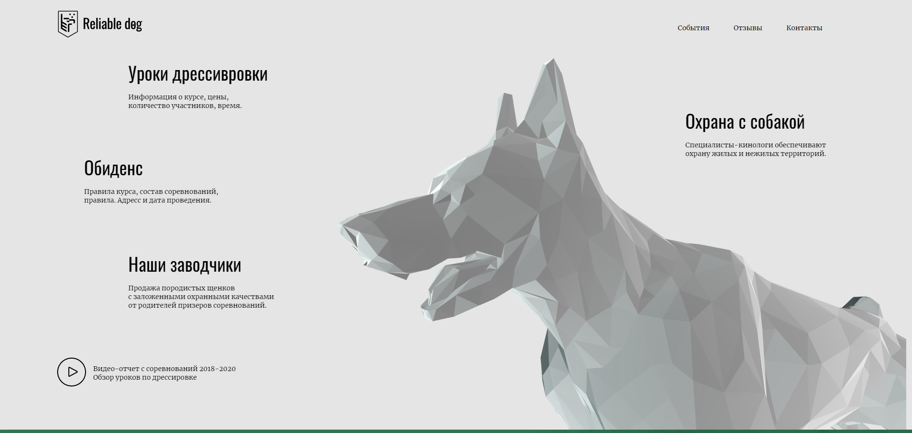
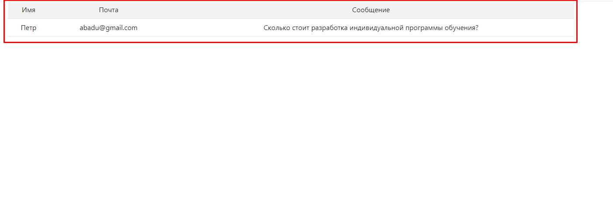

# Лабораторные работы по дисциплине "Интернет-технологии"

## ✅ Лабораторная работа № 1
Работа с GitHub:

- Регистрация в GitHub.
- Создание репозитория.
- Создание личной страницы.
- Размещение кода исходной страницы в репозитории.
- Размещение странички на хостинге.
- Веб-страничка с описанием лабораторных работ доступна по ссылке: [Web-Page.](https://github.com/icepik77/IT_lab_tech)

## ✅ Лабораторная работа № 2
В рамках 2 лабораторной работы необходимо разработать веб-сайт для заводчиков собак. Главным образом будет реализован сайт, предоставляющий пользователю информацию о заводчиках собак и возможность узнать стоимсоть различных услуг. Также клиент может оставить заявку для оформления договора по охране территории, где он может ознакомиться с заводчиками, узнать стоимость охраны и выведения той или иной породы собаки. На серверной стороне сайта будет реализовано отображение отправленных заявок клиентов.  

### Необходимые средства разработки. 
- Языки программирования:
  - JavaScript
  - CSS 3.0
  - HTML 5.0
 - Библиотеки и фреймворки:
   - BootStrap,
   - Node.js,
   - Express.js,
   - JQuery
 - Дополнительные средства: 
   - GitHub,
   - PostgreSQL
  
  Разработка ведется в команде "КОССТА".

### Результаты
  
[Сайт](https://icepik77.github.io/Dogs/index.html) для заводчиков собак.

[Репозиторий приложения](https://github.com/icepik77/dogServer) с сайтом и серверной частью.

## Процесс разработки

### Работа ПМ
Менеджер проекта следит за выполнением задач и их оценкой.

### Работа системного программиста
Выполняет проектирование системы и ее реализацию на уровне программирования.

### Работа специалиста по внедрению
Специалист по внедрению занимается оранизацией разметки страниц для лучшей поисковой индексации роботами. 

### Исследовательская работа
Исследовательская работа проводилась в рамках поиска ниши для реализации интересного проекта. В рамках данной работы изучалась предеметная область, в частности породы собак и их дрессировка. 

### Бизнес-анализ 
Дана оценка стоимости различных услуг для выведению дрессированных собак. Их стоимость указана на сайте. 

### Администрирование 
В рамках администрирования решался вопрос размещения сайта и приложения на хостингах и репозиториях.

### Консалтинг 
В рамках консалтинговых услуг был оформлен прайс лист, удобный для ознакомления пользователем, также воможно изучение различных вопросов через форму подачи заявки на странице охраны. 

### Работа приложения 

Для проверки работы приложения, необходимо установить PostgreSQL и Node.js.

Для работы приложения необходимо провести установку зависимостей. После этого запускаем приложение и переходим по запросу "https://icepik77.github.io/Dogs/index.html" Попадая на главную страницу сайта, открываем страницу "Охрана с собакой". Здесь будет поле для ввода данных клиента. Вводим их и нажимаем отправить.   Далее переходим по запросу "http://localhost:4000/users/" и нам открывается страница с запросами пользователей. 

## ✅ Лабораторная работа №3
Предоставление ранее выполненных работ по теме "Настройка локальной сети передачи данных".
Загрузка в Git-репозиторий отчета о проделанной работе в Cisco Packet Tracer.
- Сценарий доступен по [ссылке.](https://github.com/icepik77/IT_lab_tech/blob/main/CPT/Сценарий%20%20для%20CPT.pka)
- Конфигурация доступна по [ссылке.](https://github.com/icepik77/IT_lab_tech/blob/main/CPT/Форма%20отчета%20к%20ЛР3.pdf)
- Настройка сети доступна по [ссылке.](https://github.com/icepik77/IT_lab_tech/blob/main/CPT/настройка%20сети.txt)

## Экзаменационный билет 7
Ответ на экзаменационный билет доступен по ссылке: [билет № 7](https://github.com/stankin/inet-2022/wiki/exam07)

Ссылки на коммиты:
 - [Ссылка](https://github.com/stankin/inet-2022/wiki/exam07/e5d2c711318a3f2d47c6c53b4411705cb734f5a0)
 - [Ссылка](https://github.com/stankin/inet-2022/wiki/exam07/8c85403af12277dc5f6430d18b2c5790511c5880)
